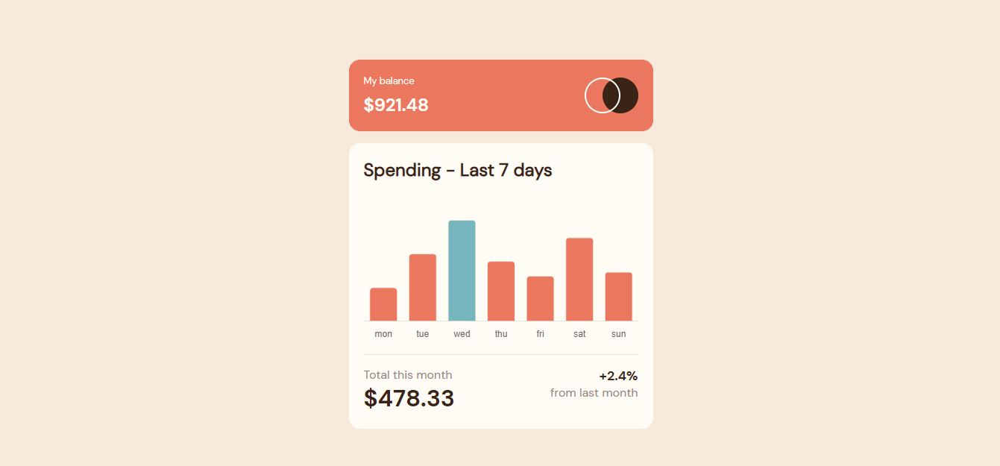

# Chart Component

Esse projeto front-end é um dos desafios propostos do site Frontend Mentor na categoria junior.

Trata - se de um **gráfico de barras dinâmico**, que ao passar o mouse sobre as barras é exibido o valor individual correspondente do dia. E dependendo do dia atual a barra tem uma cor diferente.

Escolhi esse para treinar **SASS/SCSS** (*pré processador CSS*) e utilizar a lib *chart.js* (*biblioteca de gráficos para javascript*).

 

## Tecnologias utilizadas ##

* HTML
* SASS/SCSS (CSS)
* JAVA SCRIPT (VANILLA)
* LIB chart.js

 

## Links ##

* Link do projeto page-web: https://chart-component.netlify.app/
* Link do desafio: https://www.frontendmentor.io/challenges/expenses-chart-component-e7yJBUdjwt
* Link da lib chart.js: https://www.chartjs.org/docs/latest/

